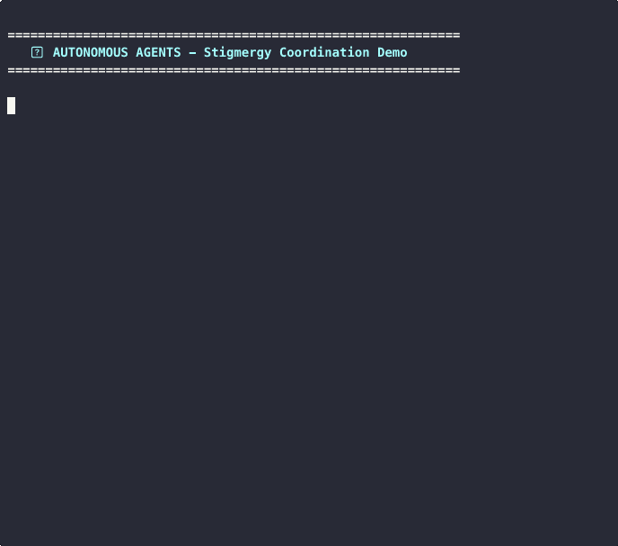

<p align="center">
  
  
  
</p>

# Multi-Agent Autonomous Development System

> **4 AI agents collaborate on software development without direct communication, coordinating like ant colonies through stigmergy.**

[](https://github.com/KeepALifeUS/autonomous-agents/actions/workflows/ci.yml)
[](https://anthropic.com)
[](LICENSE)
[](CONTRIBUTING.md)

---

## Demo

<p align="center">
  
</p>

> **Watch:** 4 AI agents collaboratively fix a bug without any direct communication. The THINKER creates the task, BUILDER-DDD claims and implements it, and GUARDIAN reviews the changes — all coordinated through Git commits.

---

## The Problem

Building with AI agents is expensive and complex:
- **Context windows fill up fast** - costs skyrocket
- **Agent coordination is hard** - message passing gets messy
- **Crashes break everything** - no fault tolerance
- **Scaling requires rewrites** - adding agents = rewriting protocols

## The Solution

**Stigmergy** - the same principle that lets ant colonies build complex structures without a leader.

```
No central coordinator. No message passing. Just shared files.
```

```
                    +-------------------------------------+
                    |         SHARED ENVIRONMENT          |
                    |            (Git Repo)               |
                    +-------------------------------------+
                                     |
        +----------------------------+----------------------------+
        |                            |                            |
        v                            v                            v
  +----------+               +--------------+              +-----------+
  | THINKER  |               |   BUILDERS   |              | GUARDIAN  |
  | Architect|               |  UI & DDD    |              | Reviewer  |
  +----------+               +--------------+              +-----------+
       |                            |                            |
       | Creates                    | Claims &                   | Reviews &
       | Tasks                      | Implements                 | Approves
       v                            v                            v
  +----------+               +--------------+              +-----------+
  | queue/   | ---------->   |  active/     | ---------->  | pending/  |
  | tasks    |               |  work        |              | reviews   |
  +----------+               +--------------+              +-----------+
```

## Key Results

| Metric | Result |
|--------|--------|
| Token Usage | **80% reduction** through incremental context loading |
| Conflicts | **Zero** with Git-based distributed mutex |
| Uptime | **Autonomous** operation for extended periods |
| Learning | **Self-improving** through pattern recognition |

## Quick Start

```bash
# Clone the repository
git clone https://github.com/KeepALifeUS/autonomous-agents.git
cd autonomous-agents

# Set up your Claude API key
export ANTHROPIC_API_KEY=your_key_here

# Start the agents
python run_agents.py
```

## How It Works

### 4 Specialized Agents

| Agent | Role | What It Does |
|-------|------|--------------|
| **THINKER** | Architect | Creates tasks, analyzes blockers, runs self-improvement |
| **BUILDER-UI** | Frontend | React, TypeScript, styling, browser testing |
| **BUILDER-DDD** | Backend | Domain logic, APIs, database services |
| **GUARDIAN** | Reviewer | Code review, quality gates, security checks |

### Stigmergy-Based Coordination

No agent talks to another. All coordination happens through files:

- **Tasks** live in `queue.json` → claimed by moving to `active.json`
- **Reviews** submitted to `pending/` → approved to `approved/`
- **Knowledge** accumulates in `patterns.jsonl` and `lessons.jsonl`

### Git as Distributed Mutex

```
1. Agent reads tasks/queue.json
2. Finds unclaimed task matching their skills
3. Moves task to tasks/active.json with their ID
4. Commits and pushes immediately
5. If push fails (conflict) → another agent claimed → retry
```

Git's conflict detection = free distributed locking.

### Self-Healing

| Problem | Solution |
|---------|----------|
| Agent crash | 4-hour timeout, auto-release task |
| Stale lock | 2-hour expiry, can override |
| Stuck task (3+ rejections) | THINKER decomposes or escalates |
| Git conflict | Auto-rebase with exponential backoff |

### Self-Improvement Cycle

Every 24 hours:
1. Collect rejections, group by pattern
2. If pattern occurs 3+ times → draft prompt improvement
3. Apply to agent, track metrics
4. Evaluate after 24h, keep or revert

## INoT Panel (Imaginary Notional Thinking)

For complex decisions, THINKER convenes a virtual expert panel:

- **Senior Engineer** - Technical feasibility
- **Product Manager** - User impact
- **QA Lead** - Testing concerns
- **Security Architect** - Security implications
- **Domain Expert** - Business logic

The panel debates in rounds, reaching consensus through structured analysis.

## Project Structure

```
autonomous-agents/
├── prompts/
│   ├── thinker/           # Architect agent instructions
│   ├── builder-ui/        # Frontend agent instructions
│   ├── builder-ddd/       # Backend agent instructions
│   └── guardian/          # Review agent instructions
├── knowledge/
│   ├── patterns.jsonl     # Validated code patterns
│   ├── anti-patterns.jsonl # Known anti-patterns
│   └── lessons.jsonl      # Recorded mistakes and fixes
├── COORDINATION.md        # Full protocol specification
└── ROADMAP.md             # Development roadmap
```

## Knowledge Base

**Patterns** - Reusable solutions:
```json
{
  "id": "P-005",
  "name": "Tenant Isolation Pattern",
  "description": "Always include tenant_id in WHERE clauses",
  "code": "SELECT * FROM jobs WHERE id = $1 AND tenant_id = $2",
  "confidence": 1.0,
  "uses": 25
}
```

**Lessons** - Recorded mistakes:
```json
{
  "id": "L-002",
  "trigger": "database query, multi-tenant lookup",
  "mistake": "Missing tenant_id in WHERE clause",
  "fix": "Always add AND tenant_id = $N to every query",
  "success_rate": 1.0
}
```

## Why Stigmergy?

| Traditional Multi-Agent | Stigmergy-Based |
|------------------------|-----------------|
| Complex message protocols | Simple file operations |
| Central coordinator needed | Fully decentralized |
| Crash = system failure | Crash = task released |
| Adding agents = rewrite | Adding agents = just add |
| State in memory | State in files (auditable) |

## Tech Stack

- **Coordination:** Git + JSON files
- **Agent Runtime:** Claude API (Anthropic)
- **Target Project:** TypeScript, React, Node.js, PostgreSQL

## Related Work

- Swarm intelligence (ant colony optimization)
- Distributed systems consensus algorithms
- Event sourcing patterns
- GitOps principles

## Contributing

Contributions welcome! See [CONTRIBUTING.md](CONTRIBUTING.md) for guidelines.

## Author

Built by [Vladyslav Shapovalov](https://linkedin.com/in/vladyslav-shapovalov-us) for an AI-powered field service platform.

## License

MIT License - see [LICENSE](LICENSE) for details.

---

<p align="center">
  <b>If this helped you, consider giving it a star!</b><br/>
  <a href="https://github.com/KeepALifeUS/autonomous-agents">
    
  </a>
</p>
